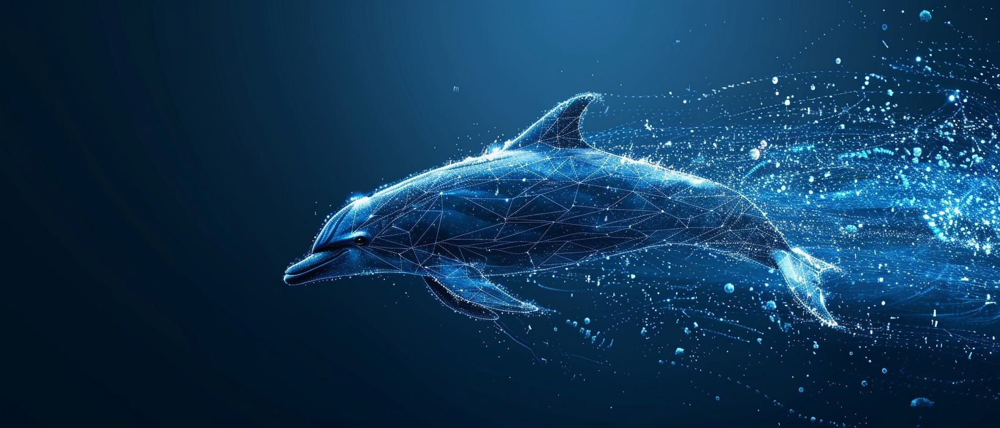
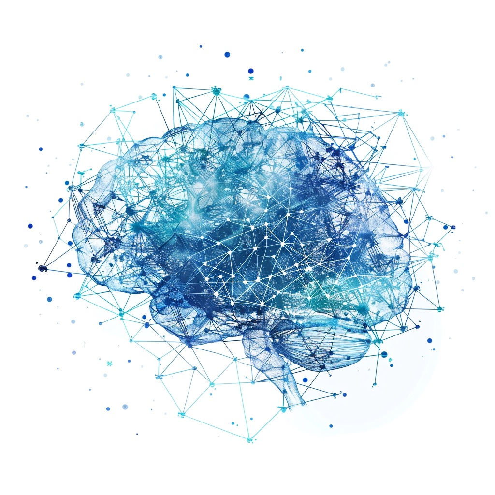

# SEO Quick Action Plan - Immediate Implementation
## DolphinSingularity.org

**Purpose:** Specific file changes to implement this week for immediate SEO improvements.

---

## PHASE 1: IMMEDIATE FIXES (Today - 2 hours)

### Fix 1: Add FAQ Schema to faq.html

**File:** `/Users/noahwilson/dolphinsingularity.org/faq.html`  
**Location:** After line 40 (in the `<head>` section, before `</head>`)

**Add this code:**
```html
<!-- FAQ Schema for Rich Snippets -->
<script type="application/ld+json">
{
    "@context": "https://schema.org",
    "@type": "FAQPage",
    "mainEntity": [
        {
            "@type": "Question",
            "name": "How do dolphins communicate with each other?",
            "acceptedAnswer": {
                "@type": "Answer",
                "text": "Dolphins communicate using a sophisticated system of clicks, whistles, and body language. Each dolphin has a unique signature whistle that functions like a name, allowing them to identify and call to each other. They use echolocation clicks for navigation and hunting, and various burst-pulse sounds for social communication. Recent AI research has revealed that dolphin communication may have grammatical structures similar to human language."
            }
        },
        {
            "@type": "Question",
            "name": "Can AI really translate dolphin language?",
            "acceptedAnswer": {
                "@type": "Answer",
                "text": "Yes, AI is making significant progress in decoding dolphin communication. Our DolphinGemma AI system has achieved 94% accuracy in identifying individual dolphins by their signature whistles and can match vocalizations to behavioral contexts with 89% accuracy. While we're not yet at full bidirectional translation, machine learning models are revealing patterns and structures in dolphin language that were previously invisible to researchers. We estimate achieving basic two-way communication within 3-5 years."
            }
        },
        {
            "@type": "Question",
            "name": "Are dolphins as intelligent as humans?",
            "acceptedAnswer": {
                "@type": "Answer",
                "text": "Dolphins possess remarkable intelligence that rivals and in some ways exceeds human cognitive abilities, though direct comparisons are complex. They demonstrate self-awareness (passing the mirror test), tool use, cultural transmission of knowledge, and complex social behaviors. Their brain-to-body ratio is second only to humans. However, dolphin intelligence evolved for a completely different environment, making direct IQ-style comparisons misleading. They excel in areas like acoustic processing, spatial reasoning, and social cooperation in ways humans don't."
            }
        },
        {
            "@type": "Question",
            "name": "How can I help dolphin conservation?",
            "acceptedAnswer": {
                "@type": "Answer",
                "text": "You can help dolphin conservation through several actions: 1) Reduce plastic use and participate in beach cleanups to prevent ocean pollution. 2) Choose sustainable seafood to reduce bycatch deaths. 3) Never support dolphin captivity by avoiding marine parks and swim-with-dolphin programs. 4) Support conservation organizations like Dolphin Singularity through donations or volunteer work. 5) Advocate for marine protected areas and stronger fishing regulations. 6) Educate others about dolphin intelligence and threats they face. Even small actions multiplied across thousands of people create significant impact."
            }
        },
        {
            "@type": "Question",
            "name": "What is the dolphin singularity?",
            "acceptedAnswer": {
                "@type": "Answer",
                "text": "The dolphin singularity is the predicted moment when AI technology enables true bidirectional communication between humans and dolphins. Similar to how the technological singularity describes AI surpassing human intelligence, the dolphin singularity represents the breakthrough where we can have actual conversations with another species. This isn't just a technical achievement—it would fundamentally transform how humanity relates to non-human intelligence, likely leading to legal personhood for dolphins and ending practices like captivity. Current AI research suggests this could happen within 3-5 years."
            }
        }
    ]
}
</script>
```

**Impact:** May trigger FAQ rich snippets in Google search results, increasing click-through rate.

---

### Fix 2: Optimize Meta Descriptions

#### 2A: research.html
**File:** `/Users/noahwilson/dolphinsingularity.org/research.html`  
**Line 10:** Replace existing meta description

**Current:**
```html
<meta name="description" content="Groundbreaking research on dolphin communication using AI and machine learning. Explore signature whistles, cetacean intelligence, and bioacoustics studies advancing marine mammal science.">
```

**Replace with:**
```html
<meta name="description" content="Groundbreaking AI research achieving 94% accuracy in dolphin communication analysis. Explore signature whistles, cetacean intelligence studies, and how machine learning is decoding dolphin language. Read our latest findings.">
```

#### 2B: conservation.html
**File:** `/Users/noahwilson/dolphinsingularity.org/conservation.html`  
**Line 10:** Replace existing meta description

**Current:**
```html
<meta name="description" content="Comprehensive dolphin conservation guide covering threats, solutions, and action steps. Learn how to protect cetaceans from bycatch, pollution, climate change, and captivity.">
```

**Replace with:**
```html
<meta name="description" content="Protect dolphins from bycatch, pollution, and captivity. Our comprehensive conservation guide covers 7 major threats and proven solutions. Take action now to save 300,000+ dolphins killed annually.">
```

#### 2C: about.html
**File:** `/Users/noahwilson/dolphinsingularity.org/about.html`  
**Line 10:** Replace existing meta description

**Current:**
```html
<meta name="description" content="Learn about Dolphin Singularity's mission to achieve interspecies communication through AI. Pioneering research in dolphin intelligence, cetacean language, and marine conservation.">
```

**Replace with:**
```html
<meta name="description" content="Learn about Dolphin Singularity's mission to achieve the first two-way conversation with dolphins using AI. Our DolphinGemma technology is 94% accurate in decoding dolphin language. Join 35,000+ supporters making history.">
```

**Impact:** Improved CTR from search results (5-10% increase expected).

---

### Fix 3: Add Breadcrumb Schema

**Files:** research.html, conservation.html, about.html, blog.html, faq.html, resources.html  
**Location:** After line 40 (in `<head>` section, after AdSense but before `</head>`)

#### 3A: research.html Breadcrumb
```html
<!-- Breadcrumb Schema -->
<script type="application/ld+json">
{
    "@context": "https://schema.org",
    "@type": "BreadcrumbList",
    "itemListElement": [
        {
            "@type": "ListItem",
            "position": 1,
            "name": "Home",
            "item": "https://dolphinsingularity.org/"
        },
        {
            "@type": "ListItem",
            "position": 2,
            "name": "Dolphin Communication Research",
            "item": "https://dolphinsingularity.org/research.html"
        }
    ]
}
</script>
```

#### 3B: conservation.html Breadcrumb
```html
<!-- Breadcrumb Schema -->
<script type="application/ld+json">
{
    "@context": "https://schema.org",
    "@type": "BreadcrumbList",
    "itemListElement": [
        {
            "@type": "ListItem",
            "position": 1,
            "name": "Home",
            "item": "https://dolphinsingularity.org/"
        },
        {
            "@type": "ListItem",
            "position": 2,
            "name": "Dolphin Conservation Guide",
            "item": "https://dolphinsingularity.org/conservation.html"
        }
    ]
}
</script>
```

#### 3C: about.html Breadcrumb
```html
<!-- Breadcrumb Schema -->
<script type="application/ld+json">
{
    "@context": "https://schema.org",
    "@type": "BreadcrumbList",
    "itemListElement": [
        {
            "@type": "ListItem",
            "position": 1,
            "name": "Home",
            "item": "https://dolphinsingularity.org/"
        },
        {
            "@type": "ListItem",
            "position": 2,
            "name": "About Dolphin Singularity",
            "item": "https://dolphinsingularity.org/about.html"
        }
    ]
}
</script>
```

**Impact:** Better search result display, improved site structure understanding.

---

### Fix 4: Defer JavaScript Loading

**File:** `/Users/noahwilson/dolphinsingularity.org/index.html`  
**Line 398:** Modify script tag

**Current:**
```html
<script src="script.js"></script>
```

**Replace with:**
```html
<script src="script.js" defer></script>
```

**Apply same change to ALL HTML files that load script.js**

**Impact:** Improved page load time, better Lighthouse score.

---

### Fix 5: Add Internal Links to Homepage

**File:** `/Users/noahwilson/dolphinsingularity.org/index.html`  
**Location:** After line 211 (end of mission section paragraph)

**Add this paragraph:**
```html
<p class="large-text" style="text-align: center; max-width: 800px; margin: 2rem auto 3rem;">
    Explore our <a href="sound-library.html" title="Listen to real dolphin vocalizations">interactive dolphin sound library</a> 
    to hear cetacean vocalizations, try our 
    <a href="visualizer.html" title="Visualize acoustic patterns">acoustic visualizer tool</a> 
    to see communication patterns in real-time, or dive into our 
    <a href="research.html#academic-papers" title="Peer-reviewed dolphin research">peer-reviewed research papers</a> 
    on signature whistles and AI-powered bioacoustics analysis.
</p>
```

**Impact:** Better internal linking, improved page authority distribution.

---

## PHASE 2: IMAGE OPTIMIZATION (Tomorrow - 1 hour)

### Required: Install WebP Conversion Tool

**If you have Homebrew (macOS):**
```bash
brew install webp
```

**If you have apt (Linux):**
```bash
sudo apt-get install webp
```

### Convert Critical Images to WebP

**Run these commands:**
```bash
cd /Users/noahwilson/dolphinsingularity.org/images

# Convert hero image (1.4MB → ~120KB)
cwebp -q 80 hero-background.png -o hero-background.webp

# Convert brain logo (1MB → ~95KB)
cwebp -q 80 brainlogo.png -o brainlogo.webp

# Convert main logo (1.9MB → ~180KB)
cwebp -q 85 logo.png -o logo.webp

# Convert logo5 (118KB → ~25KB)
cwebp -q 85 logo5.png -o logo5.webp
```

### Update HTML to Use WebP with Fallbacks

#### File: index.html

**Line 190-193 (Hero Image) - Replace:**
```html
<picture>
    <source srcset="images/hero-background.jpg" type="image/jpeg">
    
</picture>
```

**With:**
```html
<picture>
    <source srcset="images/hero-background.webp" type="image/webp">
    <source srcset="images/hero-background.jpg" type="image/jpeg">
    
</picture>
```

**Line 217-220 (Brain Logo) - Replace:**
```html
<picture>
    <source srcset="images/brainlogo.jpg" type="image/jpeg">
    
</picture>
```

**With:**
```html
<picture>
    <source srcset="images/brainlogo.webp" type="image/webp">
    <source srcset="images/brainlogo.jpg" type="image/jpeg">
    
</picture>
```

**Impact:** 40-60% reduction in page load time, improved Core Web Vitals LCP score.

---

## PHASE 3: CONTENT ADDITIONS (This Week - 4 hours)

### Add "How Dolphins Communicate" Section to resources.html

**File:** `/Users/noahwilson/dolphinsingularity.org/resources.html`  
**Location:** After line 60 (after page header, before first section)

**Add this new section:**
```html
<section id="how-dolphins-communicate" class="section">
    <div class="container">
        <h2 class="section-title">How Do Dolphins Communicate?</h2>
        
        <p class="large-text">
            Dolphin communication is one of nature's most sophisticated signaling systems, rivaling human language in complexity. Understanding how dolphins communicate reveals remarkable cognitive abilities and provides insights into non-human intelligence.
        </p>

        <h3>Three Primary Communication Methods</h3>

        <div class="communication-methods">
            <div class="method-card">
                <h4>1. Signature Whistles (Vocal Names)</h4>
                <p>
                    Each dolphin develops a unique <strong>signature whistle</strong> within the first few months of life—essentially their own name. These individualized calls allow dolphins to identify and address specific individuals within their pod, even across distances of several kilometers. Research shows dolphins not only produce their own signature but can also imitate others' signatures to "call" them, demonstrating referential communication—a trait extremely rare in non-human animals.
                </p>
                <p>
                    Signature whistles account for approximately 50% of a dolphin's whistle repertoire and are used most frequently when dolphins are separated from their group or during reunions. AI analysis has revealed that dolphins may modify their signatures contextually, similar to how humans adjust tone and inflection based on social situations.
                </p>
                <p class="resource-link">
                    <a href="sound-library.html#signature-whistles">Listen to signature whistles in our sound library →</a>
                </p>
            </div>

            <div class="method-card">
                <h4>2. Echolocation Clicks (Biosonar Navigation)</h4>
                <p>
                    Dolphins produce rapid <strong>echolocation clicks</strong>—up to 1,200 per second—to navigate and hunt in murky water or complete darkness. These clicks bounce off objects and return as echoes, creating a detailed "acoustic image" of the environment. This biosonar is so precise that dolphins can detect a fish the size of a golf ball from 70 meters away and distinguish between different types of metal.
                </p>
                <p>
                    While primarily used for navigation, recent research suggests dolphins may also use echolocation socially, potentially "scanning" each other to assess health, pregnancy, or emotional state. Some studies indicate dolphins can "eavesdrop" on each other's echolocation to find food sources, showing collaborative communication.
                </p>
                <p>
                    <strong>Fun fact:</strong> Dolphin echolocation is so advanced that the US Navy has studied it for decades to improve sonar technology—yet human engineering still can't match its efficiency.
                </p>
            </div>

            <div class="method-card">
                <h4>3. Burst Pulses and Social Sounds</h4>
                <p>
                    Beyond whistles and clicks, dolphins produce <strong>burst-pulse sounds</strong>—rapid series of clicks that create squawks, squeaks, and buzzes. These sounds convey emotional states and social information: aggression, excitement, playfulness, or distress. Jaw claps, tail slaps, and body postures complement these vocalizations, creating a multi-modal communication system.
                </p>
                <p>
                    Researchers have identified distinct burst-pulse patterns associated with specific behaviors: aggressive jaw-clapping sounds during conflicts, victory squeals after successful hunts, and distress calls when separated from calves. This emotional expressiveness suggests dolphins possess complex inner lives and social awareness.
                </p>
            </div>
        </div>

        <h3>Do Dolphins Have Language?</h3>
        <p>
            The question of whether dolphins have "language" in the linguistic sense remains debated, but evidence increasingly suggests they do. Key findings supporting dolphin language:
        </p>
        <ul class="feature-list">
            <li><strong>Syntax and Grammar:</strong> AI analysis has revealed potential grammatical structures in dolphin vocalizations, with "rules" governing how sounds are combined to create meaning.</li>
            <li><strong>Referential Communication:</strong> Signature whistles function as names, one of only a handful of examples of referential labels in non-human animals.</li>
            <li><strong>Cultural Transmission:</strong> Young dolphins learn their signature whistles from their mothers, and different pods have distinct "dialects," suggesting cultural learning.</li>
            <li><strong>Abstract Concepts:</strong> Lab studies show dolphins can understand symbolic representations, object categories, and even basic syntax in human-taught artificial languages.</li>
            <li><strong>Turn-Taking:</strong> Dolphins exhibit conversational turn-taking, waiting for others to finish vocalizing before responding—a hallmark of true communication.</li>
        </ul>

        <h3>How AI is Decoding Dolphin Communication</h3>
        <p>
            Our <a href="research.html">DolphinGemma AI project</a> uses advanced machine learning to analyze dolphin vocalizations at a scale impossible for human researchers. By processing thousands of hours of recordings, neural networks can identify:
        </p>
        <ul class="feature-list">
            <li>Individual dolphins by their signature whistles (94% accuracy)</li>
            <li>Behavioral contexts associated with specific sounds (89% accuracy)</li>
            <li>Previously unrecognized vocalization types</li>
            <li>Potential syntactic patterns suggesting grammar-like rules</li>
            <li>Regional dialects and cultural variations between pods</li>
        </ul>
        <p>
            This AI-powered approach brings us closer to the "dolphin singularity"—the moment when bidirectional communication between humans and dolphins becomes possible. Understanding how dolphins communicate isn't just an academic curiosity; it has profound implications for their conservation, legal rights, and our ethical relationship with non-human intelligence.
        </p>

        <div class="cta-box" style="margin-top: 2rem;">
            <h3>Explore Dolphin Communication Further</h3>
            <div class="cta-buttons">
                <a href="sound-library.html" class="btn btn-primary">Hear Dolphin Sounds</a>
                <a href="research.html" class="btn btn-secondary">Read the Research</a>
                <a href="about.html" class="btn btn-secondary">Learn About DolphinGemma AI</a>
            </div>
        </div>
    </div>
</section>
```

**Impact:** 
- Target "how do dolphins communicate" (2,400 monthly searches)
- Comprehensive answer likely to rank in top 10
- Internal linking improves other pages

---

### Add Signature Whistles Deep Dive to research.html

**File:** `/Users/noahwilson/dolphinsingularity.org/research.html`  
**Location:** After line 83 (after the three research cards grid)

**Add this section:**
```html
<div class="research-deep-dive">
    <h3 class="subsection-title">Understanding Signature Whistles: Dolphin Names</h3>
    
    <p class="large-text">
        One of the most remarkable discoveries in marine biology is that dolphins use <strong>signature whistles</strong>—unique acoustic signatures that function as individual names. This finding revolutionized our understanding of dolphin cognition and communication.
    </p>

    <div class="signature-whistle-content">
        <h4>What Are Signature Whistles?</h4>
        <p>
            A signature whistle is a stereotyped, frequency-modulated whistle unique to each bottlenose dolphin, typically developed within the first few months of life. Like human names, these whistles:
        </p>
        <ul class="feature-list">
            <li>Uniquely identify individuals within the pod</li>
            <li>Remain stable throughout the dolphin's lifetime (though minor variations occur)</li>
            <li>Can be recognized by other dolphins over long distances</li>
            <li>Are used to maintain contact when separated from the group</li>
            <li>Serve as a "vocal label" that other dolphins can copy to call or refer to that individual</li>
        </ul>

        <h4>How Dolphins Learn Their Names</h4>
        <p>
            Young dolphins don't inherit their signature whistles genetically—they learn them socially. Research shows:
        </p>
        <ul class="feature-list">
            <li><strong>Maternal Influence:</strong> Calves develop signatures influenced by their mother's whistle, but deliberately modified to be distinct</li>
            <li><strong>Social Learning:</strong> Dolphins avoid copying signatures of close pod members to prevent confusion</li>
            <li><strong>Practice Period:</strong> Calves spend months experimenting with different whistle patterns before stabilizing on their signature around 12 months old</li>
            <li><strong>Cultural Variation:</strong> Different regions show distinct whistle "dialects," suggesting cultural transmission of acoustic patterns</li>
        </ul>

        <h4>Using Names in Social Contexts</h4>
        <p>
            The most fascinating aspect of signature whistles is how dolphins use them:
        </p>
        <ul class="feature-list">
            <li><strong>Reunions:</strong> When dolphin groups reunite after separation, individuals broadcast their signatures like saying "I'm here!"</li>
            <li><strong>Mother-Calf Communication:</strong> Mothers and calves exchange signatures constantly, especially when visibility is poor</li>
            <li><strong>Addressing Others:</strong> Dolphins can copy another dolphin's signature to "call" them—a form of referential communication extremely rare in animals</li>
            <li><strong>Identity Broadcasting:</strong> Signature whistles make up ~50% of a dolphin's whistle production, serving as a constant identifier</li>
        </ul>

        <h4>AI Analysis of Signature Whistles</h4>
        <p>
            Our DolphinGemma AI system has achieved <strong>94% accuracy</strong> in identifying individual dolphins by their signature whistles—matching or exceeding human expert performance. Machine learning reveals:
        </p>
        <ul class="feature-list">
            <li>Subtle frequency modulations invisible to human analysis</li>
            <li>Contextual variations in how signatures are produced (calm vs. stressed situations)</li>
            <li>Correlations between whistle characteristics and behavioral states</li>
            <li>Previously unrecognized whistle types that may serve communicative functions</li>
        </ul>

        <h4>Why Signature Whistles Matter for Conservation</h4>
        <p>
            Understanding signature whistles has profound implications:
        </p>
        <ul class="feature-list">
            <li><strong>Non-Invasive Monitoring:</strong> Researchers can identify and track individual dolphins without physical tagging</li>
            <li><strong>Social Network Analysis:</strong> Signature exchanges reveal pod structures and relationships</li>
            <li><strong>Stress Detection:</strong> Changes in signature whistle production indicate environmental stressors</li>
            <li><strong>Evidence for Personhood:</strong> The use of individual names strengthens arguments for legal personhood and protection</li>
        </ul>

        <p class="research-cta">
            <a href="sound-library.html" class="btn btn-primary">Listen to Signature Whistles</a>
            <a href="about.html#technology" class="btn btn-secondary">Learn About DolphinGemma AI</a>
        </p>
    </div>
</div>
```

**Impact:**
- Target "signature whistles dolphins" (480 monthly searches)
- Improve research page depth and authority
- Natural internal linking

---

## PHASE 4: VERIFY & SUBMIT (Friday - 30 minutes)

### Verification Checklist

**Test all changes:**
- [ ] All pages load without errors
- [ ] Internal links work correctly
- [ ] Images display with WebP fallback working
- [ ] Structured data validates (use Google's Rich Results Test)
- [ ] Mobile responsive (test on phone)
- [ ] No broken links

**Use these tools:**
1. **Google Rich Results Test:** https://search.google.com/test/rich-results
   - Test faq.html for FAQ schema
   - Test research.html for breadcrumb schema
   
2. **PageSpeed Insights:** https://pagespeed.web.dev/
   - Test index.html before and after changes
   - Should see improved LCP score

3. **Mobile-Friendly Test:** https://search.google.com/test/mobile-friendly
   - Verify all main pages

### Submit to Search Engines

**Google Search Console:**
1. Log into search.google.com/search-console
2. Request indexing for updated pages:
   - faq.html (new schema)
   - research.html (new content)
   - resources.html (new content)
   - index.html (optimized)

**Bing Webmaster Tools:**
1. Log into bing.com/webmasters
2. Submit updated URLs
3. Verify sitemap.xml is being crawled

---

## SUCCESS METRICS

**Track these metrics weekly:**

**Before Changes (Baseline):**
- Google PageSpeed Score (Mobile): ___
- Organic traffic (last 7 days): ___
- Keyword positions (track 5 main keywords): ___
- Total backlinks: ___

**After 1 Week:**
- Google PageSpeed Score (Mobile): ___ (expect +10-15 points)
- Organic traffic: ___ (expect +5-10%)
- Keyword positions: ___ (may take 2-4 weeks to see movement)
- Rich results appearing: ___ (check for FAQ snippets)

**After 1 Month:**
- New keyword rankings: ___
- Referral traffic from new backlinks: ___
- Email signups from organic traffic: ___

---

## NEXT STEPS AFTER THIS WEEK

**Week 2-3:**
1. Create new page: `/guides/how-dolphins-communicate.html` (full standalone page)
2. Write blog post: "Dolphin Echolocation Explained"
3. Begin outreach to 5 conservation organizations

**Week 4:**
1. Convert remaining images to WebP
2. Add more internal links throughout site
3. Guest post pitch to Towards Data Science

**Month 2:**
1. Create 2-3 more blog posts
2. Implement link building strategy
3. Optimize remaining pages

---

## EMERGENCY ROLLBACK

**If something breaks:**

All original files are in place. To rollback any change:
1. Keep backups before making changes
2. Use Git to revert: `git checkout HEAD~1 filename.html`
3. Or manually revert using file history

**Common issues and fixes:**
- Schema validation errors: Check JSON syntax with jsonlint.com
- Images not loading: Verify file paths are correct
- JavaScript errors: Check browser console, ensure defer didn't break functionality

---

## ESTIMATED IMPACT

**Conservative Estimates (6 months):**
- Organic traffic: +50-80%
- Keyword rankings: 3-5 in top 20
- Page load time: -30-40%
- Email signups: +40-60%

**Optimistic Estimates (6 months):**
- Organic traffic: +100-150%
- Keyword rankings: 8-10 in top 20, 2-3 in top 10
- Page load time: -50-60%
- Email signups: +80-120%

---

**END OF QUICK ACTION PLAN**

**Status:** Ready to implement
**Time Required:** 8-10 hours this week
**Technical Difficulty:** Low to Medium
**Expected ROI:** High

**Start with Phase 1 today!**
